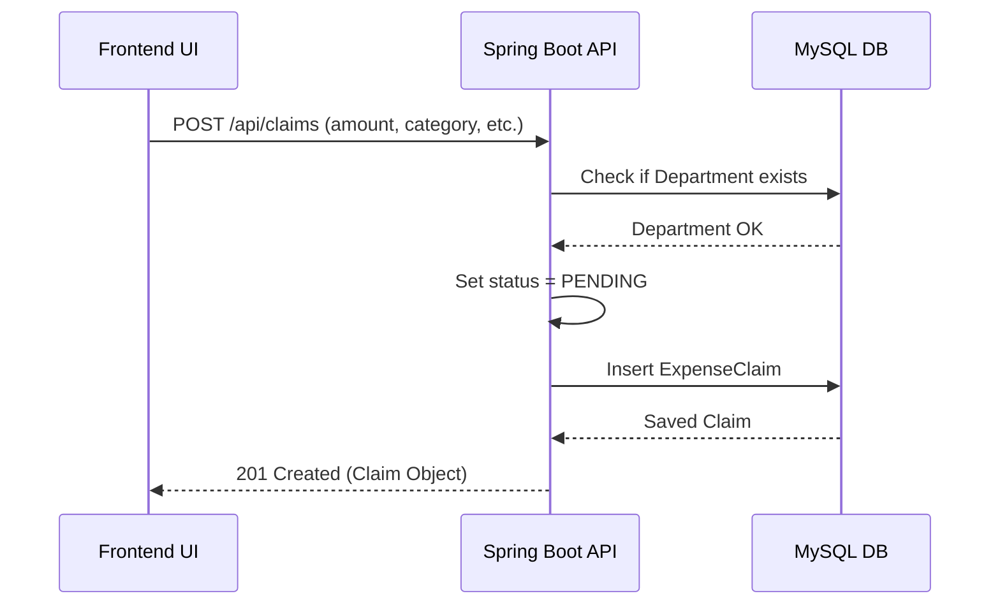
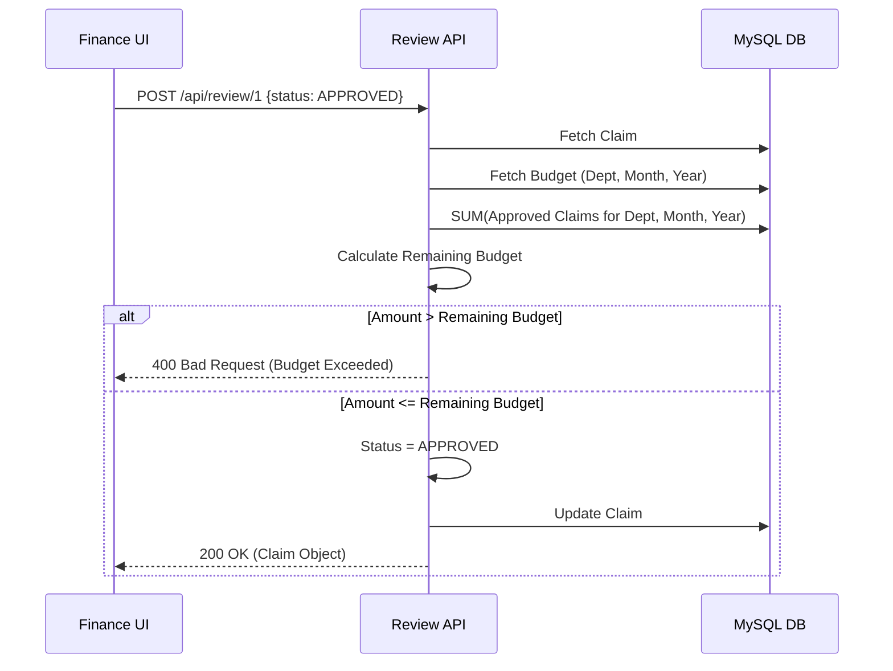
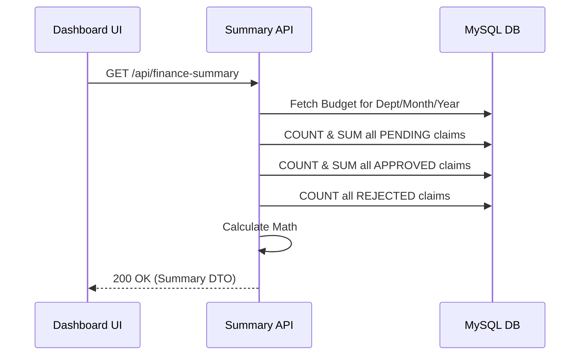
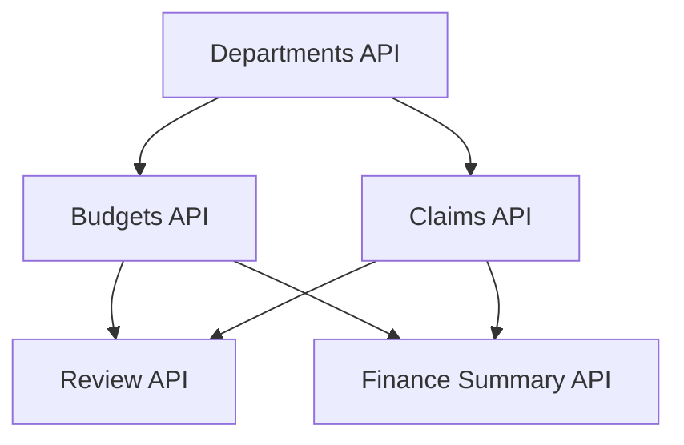

# Frontend Integration Document: Department Expense Approval System

This document is the **single source of truth** for frontend engineers integrating with the Department Expense Approval System backend. It contains comprehensive details regarding API structures, data types, business rules, sequences, and UI flow mapping.

---

## 1. Project Overview

The Department Expense Approval System is a backend microservice built to manage internal company expenses. It allows departments to define monthly budgets and employees to submit expense claims against those departments. Finance Managers review, approve, or reject these claims, and the system automatically deducts approved claims from the allocated department budget.

---

## 2. Authentication

**No authentication is implemented** in the current phase of the backend. 
- You do **NOT** need to send `Authorization: Bearer <token>` headers.
- There is no concept of a "Logged In User". Employee names are manually submitted in the payload when creating a claim.

---

## 3. Base URL

In local development, the backend runs on:
```text
http://localhost:8080
```
All API paths listed below are relative to this base URL. Ensure your frontend HTTP client uses a globally configured base URL.

---

## 4. API List

| Module | Endpoint | Method | Description |
|---|---|---|---|
| **Departments** | `/api/departments` | `POST` | Create a new department. |
| | `/api/departments` | `GET` | Get all departments. |
| | `/api/departments/{id}` | `GET` | Get a department by ID. |
| | `/api/departments/{id}` | `PUT` | Update a department. |
| | `/api/departments/{id}` | `DELETE` | Delete a department. |
| **Budgets** | `/api/budgets` | `POST` | Allocate a new monthly budget. |
| | `/api/budgets` | `GET` | Get all budgets. |
| | `/api/budgets/department/{id}`| `GET` | Get budgets for a specific department. |
| | `/api/budgets/{id}` | `GET` | Get a specific budget by ID. |
| | `/api/budgets/{id}` | `PUT` | Update a budget. |
| | `/api/budgets/{id}` | `DELETE` | Delete a budget. |
| **Claims** | `/api/claims` | `POST` | Submit a new expense claim. |
| | `/api/claims` | `GET` | Get paginated & filtered expense claims. |
| | `/api/claims/{id}` | `GET` | Get an expense claim by ID. |
| | `/api/claims/{id}` | `PUT` | Update a PENDING expense claim. |
| | `/api/claims/{id}` | `DELETE` | Delete a PENDING expense claim. |
| **Finance Review**| `/api/review/{claimId}` | `POST` | Approve or Reject a claim. |
| **Finance Summary**| `/api/finance-summary`| `GET` | Get monthly financial summary. |

---

## 5. Request Details & Validation Rules

### Departments
- **Path Variables:** `{id}` (Long) for GET/PUT/DELETE.
- **Request Body (POST/PUT):**
  ```json
  {
    "departmentName": "Engineering"
  }
  ```
  - `departmentName`: Required, String, Unique, Trimmed by backend.

### Budgets
- **Path Variables:** `{id}` (Long) for GET/PUT/DELETE, `{departmentId}` for `/department/{id}` GET.
- **Request Body (POST/PUT):**
  ```json
  {
    "departmentId": 1,
    "month": "JANUARY",
    "year": 2026,
    "budgetAmount": 50000.00
  }
  ```
  - `departmentId`: Required, Long (Must refer to an existing department).
  - `month`: Required, Enum (`JANUARY`, `FEBRUARY`, etc.).
  - `year`: Required, Integer (Min: 2000, Max: 2100).
  - `budgetAmount`: Required, Decimal, Must be strictly > 0.
  - **Rule:** Cannot update `departmentId`, `month`, or `year` via `PUT`.

### Expense Claims
- **Path Variables:** `{id}` (Long) for GET/PUT/DELETE.
- **Query Parameters (GET):**
  - `departmentId` (Long), `expenseCategory` (Enum), `status` (Enum), `month` (Integer), `year` (Integer), `employeeName` (String).
  - Pagination: `page` (default 0), `size` (default 10), `sortBy` (default `createdAt`), `sortDir` (default `desc`).
- **Request Body (POST/PUT):**
  ```json
  {
    "employeeName": "John Doe",
    "departmentId": 1,
    "expenseCategory": "TRAVEL",
    "amount": 1500.50,
    "expenseDate": "2026-01-20",
    "description": "Client meeting flight"
  }
  ```
  - `employeeName`: Required, String, Min 2, Max 100.
  - `departmentId`: Required, Long.
  - `expenseCategory`: Required, Enum (`TRAVEL`, `MEALS`, `SUPPLIES`, `EQUIPMENT`, `OTHER`).
  - `amount`: Required, Decimal, strictly > 0.
  - `expenseDate`: Required, Date (`YYYY-MM-DD`), Cannot be in the future.
  - `description`: Optional, String, Max 500.
  - **Rule:** Status is automatically set to `PENDING` internally.

### Finance Review
- **Path Variables:** `{claimId}` (Long).
- **Request Body (POST):**
  ```json
  {
    "recommendedStatus": "APPROVED",
    "reviewRemark": "Receipts verified."
  }
  ```
  - `recommendedStatus`: Required, Enum (`APPROVED`, `REJECTED`). `PENDING` is rejected by backend.
  - `reviewRemark`: Required if `REJECTED`, Optional if `APPROVED`.

### Finance Summary
- **Query Parameters (GET):**
  - `departmentId`: Required, Long.
  - `month`: Required, Integer (1-12).
  - `year`: Required, Integer (e.g., 2026).

---

## 6. Response Details

### Standard `GlobalResponse` Structure
Every API returns a consistent JSON envelope, regardless of HTTP Status Code.

**Success Response (HTTP 200, 201):**
```json
{
  "success": true,
  "message": "Resource created successfully",
  "data": { ... },
  "timestamp": "2026-06-30T17:00:11.418828"
}
```

**Error Response (HTTP 400, 404, 409, 500):**
```json
{
  "success": false,
  "message": "Error description",
  "data": null,
  "timestamp": "2026-06-30T17:00:11.418828"
}
```
*Note: For Validation errors (HTTP 400), `message` will be an array of string error messages.*

### Custom Pagination Payload
When fetching `GET /api/claims`, the `data` object conforms to this structure:
```json
"data": {
    "content": [ ... array of objects ... ],
    "pageNumber": 0,
    "pageSize": 10,
    "totalElements": 2,
    "totalPages": 1,
    "last": true
}
```

---

## 7. Business Rules (Enforced by Backend)

1. **Pending Claims Only**: A user can only submit `PUT` or `DELETE` requests to an Expense Claim if its status is `PENDING`. Modifying approved/rejected claims triggers a `400 Bad Request`.
2. **Review Strictness**: An `APPROVED` or `REJECTED` claim cannot be reviewed again. A `400 Bad Request` is thrown.
3. **Budget Validation**: The Finance Manager cannot approve a claim if `Claim Amount > Remaining Budget`. Remaining budget is dynamically calculated as: `Total Budget - SUM(Approved Claims)`.
4. **Non-Consumption**: `PENDING` and `REJECTED` claims **do not** consume the monthly budget.
5. **No Orphan Data**: You cannot delete a Department if it has any associated Budgets or Expense Claims.
6. **Unique Budgets**: A department can only have exactly ONE budget per `Month` and `Year`.
7. **Concurrency (Optimistic Locking)**: If two users edit/approve the same claim or budget simultaneously, the backend throws an `HTTP 409 Conflict`. You must reload the data and try again.

---

## 8. Error Codes

| HTTP Status | Trigger Conditions |
|---|---|
| **`400 Bad Request`** | JSON Validation failed (e.g., missing required fields, negative amounts), Attempting to review an already reviewed claim, Attempting to edit/delete a non-pending claim, Exceeding department budget during approval, Trying to delete a Department with active records. |
| **`404 Not Found`** | ID does not exist in the database (e.g., `GET /api/claims/999`), or querying a Finance Summary for a Month/Year where no budget was allocated. |
| **`409 Conflict`** | Unique constraint violation (e.g., Duplicate Department Name, Duplicate Budget for Month/Year), or JPA Optimistic Locking failure (concurrent edits). |
| **`500 Server Error`** | Unhandled internal exception. |

---

## 9. Frontend Flow

A typical user flow through the application:
1. **Admin Setup**: Load `GET /api/departments`. Create Departments (`POST /api/departments`).
2. **Budget Setup**: Create Budgets for the current month (`POST /api/budgets`).
3. **Employee Submission**: Employee selects a department from a dropdown, fills out the form, and submits (`POST /api/claims`).
4. **Finance Review Board**: Finance views a paginated list of claims (`GET /api/claims?status=PENDING`). They click "Review".
5. **Approval Action**: Finance clicks "Approve" (`POST /api/review/{id}`).
6. **Reporting**: Finance views the Dashboard (`GET /api/finance-summary`).

---

## 10. Screen Mapping

| Frontend Page | API Calls Used |
|---|---|
| **Departments Setup** | `GET /api/departments`<br>`POST /api/departments`<br>`PUT /api/departments/{id}`<br>`DELETE /api/departments/{id}` |
| **Budget Setup** | `GET /api/budgets`<br>`POST /api/budgets`<br>`PUT /api/budgets/{id}`<br>`DELETE /api/budgets/{id}` |
| **Submit Expense Form** | `GET /api/departments` (Dropdown)<br>`POST /api/claims` |
| **My Expenses (Employee)**| `GET /api/claims?employeeName={name}`<br>`PUT /api/claims/{id}`<br>`DELETE /api/claims/{id}` |
| **Review Inbox (Finance)** | `GET /api/claims?status=PENDING`<br>`POST /api/review/{id}` |
| **Financial Dashboard** | `GET /api/finance-summary?departmentId={id}&month={m}&year={y}` |

---

## 11. Sequence Diagrams

### Claim Submission


### Claim Approval & Budget Validation


### Finance Summary


---

## 12. API Dependency Diagram

*Note: You must have Departments to create Budgets. You must have Departments to create Claims. You must have Budgets and Claims to perform Reviews or pull Summaries.*

---

## 13. Integration Notes

- **Date Format:** Standard ISO-8601 (`YYYY-MM-DD` for LocalDate, `YYYY-MM-DDTHH:MM:SS.mmmmmm` for LocalDateTime). Do not append timezone offsets (`Z`) when submitting LocalDates.
- **Enums:** Must be submitted as exact UPPERCASE strings (e.g., `"JANUARY"`, `"TRAVEL"`, `"APPROVED"`).
- **Validation Messages:** When a 400 Validation error happens, `message` is a `List<String>`. Example: `["Amount must be positive", "Description is too long"]`. You can `join(", ")` them for the UI toast notification.
- **Flattened Payloads:** The `ExpenseClaimResponseDTO` flattens the `department` entity to a string. It returns `"department": "Engineering"`, NOT an object.

---

## 14. Complete JSON Examples

### POST `/api/claims`
**Request:**
```json
{
    "employeeName": "Jane Smith",
    "departmentId": 1,
    "expenseCategory": "MEALS",
    "amount": 45.50,
    "expenseDate": "2026-06-30",
    "description": "Lunch with client"
}
```
**Response (201 Created):**
```json
{
    "success": true,
    "message": "Expense Claim submitted successfully",
    "data": {
        "id": 5,
        "employeeName": "Jane Smith",
        "department": "Engineering",
        "expenseCategory": "MEALS",
        "amount": 45.50,
        "expenseDate": "2026-06-30",
        "description": "Lunch with client",
        "status": "PENDING",
        "reviewRemark": null,
        "reviewedAt": null,
        "createdAt": "2026-06-30T17:30:00.000",
        "updatedAt": "2026-06-30T17:30:00.000"
    },
    "timestamp": "2026-06-30T17:30:00.001"
}
```

### POST `/api/review/5`
**Request:**
```json
{
    "recommendedStatus": "APPROVED",
    "reviewRemark": "Looks good."
}
```
**Response (200 OK):**
```json
{
    "success": true,
    "message": "Claim reviewed successfully",
    "data": {
        "id": 5,
        "employeeName": "Jane Smith",
        "department": "Engineering",
        "expenseCategory": "MEALS",
        "amount": 45.50,
        "expenseDate": "2026-06-30",
        "description": "Lunch with client",
        "status": "APPROVED",
        "reviewRemark": "Looks good.",
        "reviewedAt": "2026-06-30T17:35:00.000",
        "createdAt": "2026-06-30T17:30:00.000",
        "updatedAt": "2026-06-30T17:35:00.000"
    },
    "timestamp": "2026-06-30T17:35:00.001"
}
```

### GET `/api/finance-summary?departmentId=1&month=6&year=2026`
**Request:** (None)

**Response (200 OK):**
```json
{
    "success": true,
    "message": "Finance summary generated successfully",
    "data": {
        "department": "Engineering",
        "month": "JUNE",
        "year": 2026,
        "monthlyBudget": 50000.00,
        "totalApprovedExpense": 45.50,
        "totalPendingExpense": 0.00,
        "remainingBudget": 49954.50,
        "approvedClaimCount": 1,
        "pendingClaimCount": 0,
        "rejectedClaimCount": 0
    },
    "timestamp": "2026-06-30T17:40:00.001"
}
```

---

## 15. Conclusion
This document covers 100% of the REST APIs exposed by the backend for the Department Expense Approval System. By strictly adhering to these paths, request schemas, and business rules, frontend engineers can build, test, and integrate the UI without needing access to the backend source code.
